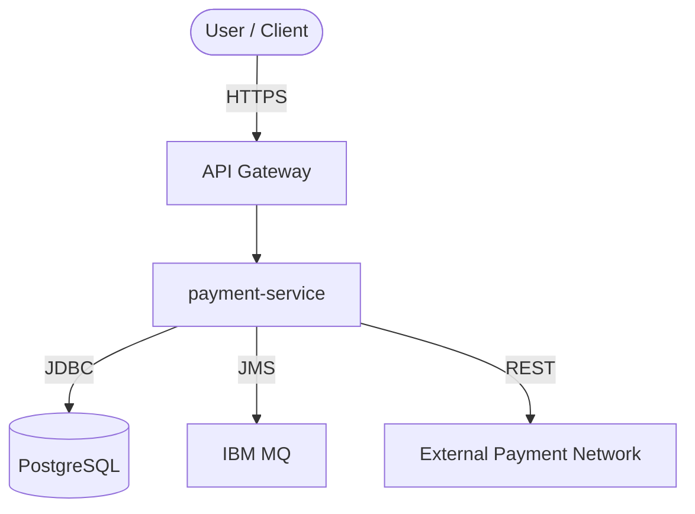
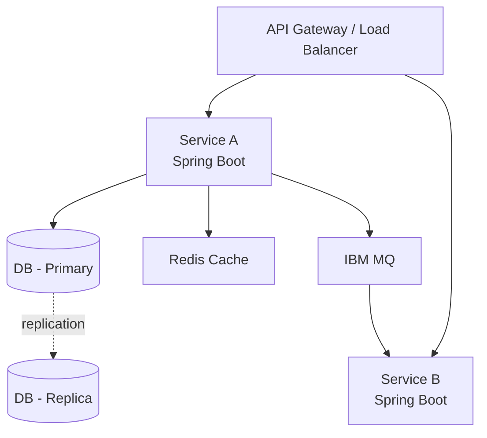

# High-Level Design (HLD)

> **Status:** `DRAFT` | `UNDER_REVIEW` | `APPROVED`
> **Version:** 1.0.0
> **LRS Reference:** LRS-{ID}
> **Author:** {Name} + AI-assisted
> **Approved By:** {Architect Name} — {Date}

---

## 1. Executive Summary

> 2-3 sentences summarising the solution approach for non-technical stakeholders.

---

## 2. System Context (C4 Level 1)

> Describe the system boundary and all external actors/systems.

```
[User] ──► [THIS SYSTEM] ──► [External System A]
                          ──► [External System B]
                          ◄── [External System C]
```

> Replace with a Mermaid diagram:



---

## 3. Component Architecture (C4 Level 2)

> Internal components within the system boundary.



---

## 4. Technology Stack

| Layer | Technology | Version | Rationale |
|-------|-----------|---------|-----------|
| Language | Java | 17 LTS | Company standard |
| Framework | Spring Boot | 3.x | Company standard |
| Database | PostgreSQL | 15 | ACID compliance |
| Messaging | IBM MQ | 9.4 | Enterprise messaging standard |
| Container | Docker | Latest | OCI standard |
| Orchestration | Kubernetes (EKS / OCP) | 1.29+ | Company platform |
| Build | Maven | 3.9 | Company standard |
| API Style | REST / JSON | OpenAPI 3.0 | Company API standard |

---

## 5. Data Flow Overview

> Describe the primary data flows through the system.

### Flow 1: {Primary Use Case}
```
1. Client sends POST /api/v1/{resource}
2. API Gateway authenticates via OAuth2 token introspection
3. Service validates request payload
4. Service persists to PostgreSQL (within @Transactional boundary)
5. Service publishes event to IBM MQ topic
6. Downstream consumer processes event asynchronously
7. Service returns 201 Created with resource link
```

---

## 6. Security Architecture

| Concern | Approach |
|---------|----------|
| Authentication | OAuth2 / OIDC — Spring Security Resource Server |
| Authorisation | RBAC via JWT claims |
| Transport Security | TLS 1.2+ enforced at gateway |
| Data at Rest | AES-256 encryption for PII fields |
| Secret Management | HashiCorp Vault / AWS Secrets Manager |
| Network | Private VPC subnets, Security Groups / Network Policies |
| API Security | Rate limiting, input validation, OWASP headers |

### Trust Boundary Diagram

```
[Internet Zone]
    │  (TLS)
[DMZ — API Gateway / WAF]
    │  (mTLS or internal TLS)
[App Zone — Kubernetes Namespace]
    │  (JDBC over TLS)
[Data Zone — RDS / PostgreSQL]
```

---

## 7. NFR Architecture Decisions

| NFR | Target | Approach |
|-----|--------|----------|
| Availability | 99.9% | Multi-AZ deployment, PodDisruptionBudget ≥ 2 |
| Scalability | 10x baseline | HPA on CPU/RPS, stateless services |
| Performance | P95 < 500ms | Redis caching, async processing, DB indexes |
| DR / RTO | < 1 hour | Multi-AZ DB, automated failover |
| DR / RPO | < 15 min | DB point-in-time recovery enabled |

---

## 8. Integration Architecture

| Integration | System | Pattern | Protocol | Auth |
|------------|--------|---------|----------|------|
| Inbound | API consumers | Synchronous REST | HTTPS | OAuth2 |
| Outbound | {System} | Async event | IBM MQ / JMS | MQ credentials via Vault |
| Outbound | {System} | Synchronous REST | HTTPS | API Key via Vault |

---

## 9. Deployment Overview

- **Target platforms:** Amazon EKS (cloud) / OpenShift OCP (on-prem)
- **Regions / Zones:** {specify}
- **Environment ladder:** DEV → SIT → UAT → PERF → PROD
- **Release strategy:** Canary (progressive traffic shift) / Blue-Green

---

## 10. Architecture Decision Records (ADRs)

| ADR | Decision | Rationale | Alternatives Considered |
|-----|---------|-----------|------------------------|
| ADR-001 | Use IBM MQ for async messaging | Enterprise standard, existing licences | Kafka, RabbitMQ |
| ADR-002 | PostgreSQL over Oracle | Cost, open-source, team expertise | Oracle, MySQL |

---

## 11. Approval

| Role | Name | Decision | Date |
|------|------|---------|------|
| Principal Architect | | ☐ Approved / ☐ Rejected | |
| Security Architect | | ☐ Approved / ☐ Rejected | |
| Engineering Lead | | ☐ Approved / ☐ Rejected | |

---

> **Next Step:** Upon HLD approval, proceed to Low-Level Design (LLD).
