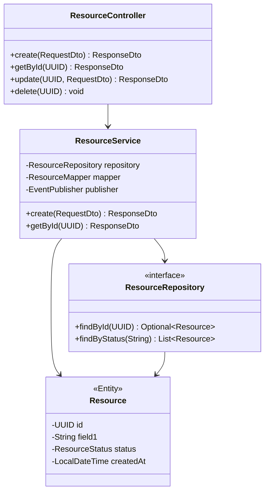
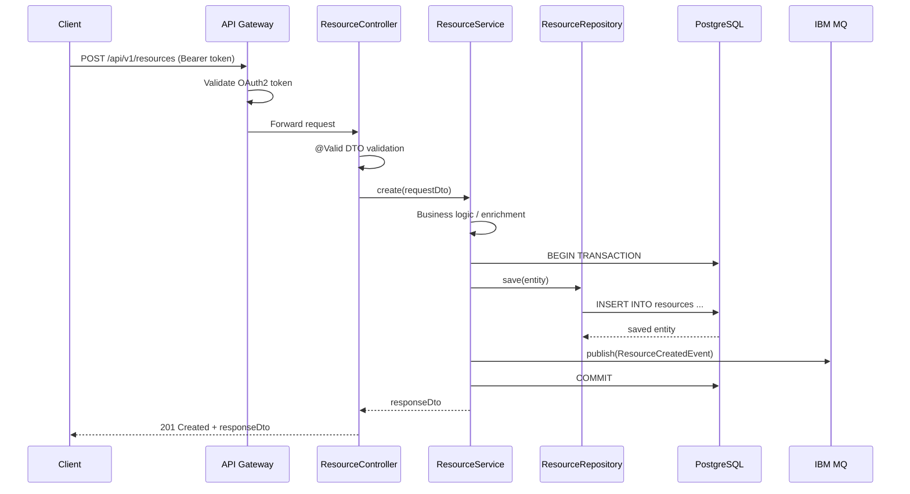
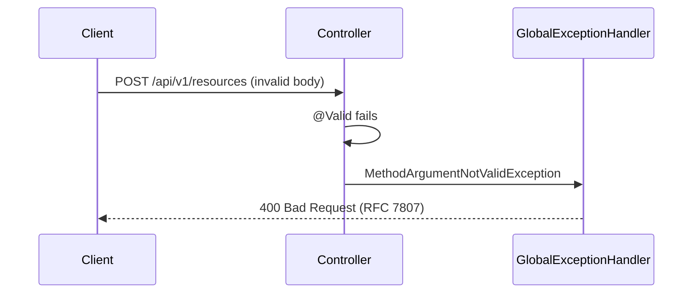

# Low-Level Design (LLD)

> **Status:** `DRAFT` | `UNDER_REVIEW` | `APPROVED`
> **Version:** 1.0.0
> **LRS Reference:** LRS-{ID}
> **HLD Reference:** HLD-{ID} v{version}
> **Author:** {Name} + AI-assisted
> **Approved By:** {Engineer Name} — {Date}

---

## 1. Service Overview

| Field | Value |
|-------|-------|
| Service Name | {service-name} |
| Package Base | com.{company}.{domain} |
| Spring Boot Version | 3.x |
| Java Version | 17 |
| Port | 8080 |
| Context Path | /api/v1 |
| Jira Component | {component-name} |

---

## 2. Package Structure

```
com.company.servicename/
├── config/              # Spring configuration classes
├── controller/          # REST controllers (@RestController)
├── service/             # Business logic (@Service)
├── repository/          # Data access (@Repository)
├── domain/
│   ├── entity/          # JPA entities
│   ├── dto/             # Request/Response DTOs
│   └── mapper/          # MapStruct mappers
├── exception/           # Custom exceptions + GlobalExceptionHandler
├── security/            # Security config, JWT filter
├── messaging/           # JMS producers/consumers
└── util/                # Utility classes
```

---

## 3. API Contracts (OpenAPI 3.0)

> Full OpenAPI spec to be generated by AI from these specifications.

### Endpoint: POST /api/v1/{resource}

| Field | Value |
|-------|-------|
| Method | POST |
| Path | /api/v1/{resource} |
| Auth | Bearer Token (OAuth2) |
| Content-Type | application/json |
| Success Response | 201 Created |

**Request Body:**
```json
{
  "field1": "string",
  "field2": 0,
  "field3": "2024-01-01T00:00:00Z"
}
```

**Response Body:**
```json
{
  "id": "uuid",
  "field1": "string",
  "createdAt": "2024-01-01T00:00:00Z",
  "_links": {
    "self": { "href": "/api/v1/{resource}/{id}" }
  }
}
```

**Error Response (RFC 7807):**
```json
{
  "type": "https://api.company.com/errors/validation-error",
  "title": "Validation Failed",
  "status": 400,
  "detail": "Field 'field1' must not be blank",
  "instance": "/api/v1/{resource}",
  "traceId": "abc123"
}
```

---

## 4. Data Model

### Entity: {EntityName}

```sql
CREATE TABLE {table_name} (
    id          UUID PRIMARY KEY DEFAULT gen_random_uuid(),
    field1      VARCHAR(255) NOT NULL,
    field2      NUMERIC(19,2),
    status      VARCHAR(50) NOT NULL,
    created_at  TIMESTAMP WITH TIME ZONE DEFAULT NOW(),
    updated_at  TIMESTAMP WITH TIME ZONE DEFAULT NOW(),
    created_by  VARCHAR(100) NOT NULL,
    version     BIGINT DEFAULT 0    -- optimistic locking
);

CREATE INDEX idx_{table_name}_status ON {table_name}(status);
CREATE INDEX idx_{table_name}_created_at ON {table_name}(created_at);
```

### Database Migration Strategy
- Tool: **Flyway**
- Script naming: `V{version}__{description}.sql`
- Location: `src/main/resources/db/migration/`
- Rollback scripts: `U{version}__{description}.sql`

---

## 5. Class Diagram



---

## 6. Sequence Diagrams

### Use Case: Create Resource (Happy Path)



### Use Case: Validation Failure



---

## 7. Error Handling Strategy

| Exception | HTTP Status | Logged | Alerted |
|-----------|------------|--------|---------|
| MethodArgumentNotValidException | 400 | WARN | No |
| ResourceNotFoundException | 404 | INFO | No |
| DuplicateResourceException | 409 | WARN | No |
| DataAccessException | 500 | ERROR | Yes |
| ExternalServiceException | 502 | ERROR | Yes |
| Unhandled Exception | 500 | ERROR | Yes |

All errors returned in **RFC 7807 Problem Details** format.
All errors include **traceId** (MDC correlation ID).

---

## 8. Messaging Design (IBM MQ)

| Topic / Queue | Direction | Message Type | Schema |
|--------------|-----------|-------------|--------|
| `COMPANY.{SERVICE}.CREATED` | Outbound | ResourceCreatedEvent | JSON |
| `COMPANY.{SERVICE}.INBOUND` | Inbound | ExternalEvent | JSON |

**Message Schema — ResourceCreatedEvent:**
```json
{
  "eventId": "uuid",
  "eventType": "RESOURCE_CREATED",
  "timestamp": "2024-01-01T00:00:00Z",
  "version": "1.0",
  "payload": {
    "resourceId": "uuid",
    "status": "ACTIVE"
  }
}
```

**Dead Letter Queue:** `COMPANY.{SERVICE}.DLQ`
**Retry strategy:** 3 attempts with exponential backoff (1s, 2s, 4s)

---

## 9. Security Implementation

```java
// Spring Security Config outline
@Configuration
@EnableWebSecurity
public class SecurityConfig {

    @Bean
    public SecurityFilterChain filterChain(HttpSecurity http) throws Exception {
        return http
            .oauth2ResourceServer(oauth2 -> oauth2.jwt(Customizer.withDefaults()))
            .authorizeHttpRequests(auth -> auth
                .requestMatchers("/actuator/health/**").permitAll()
                .requestMatchers(HttpMethod.GET, "/api/v1/**").hasAuthority("SCOPE_read")
                .requestMatchers(HttpMethod.POST, "/api/v1/**").hasAuthority("SCOPE_write")
                .anyRequest().authenticated()
            )
            .sessionManagement(s -> s.sessionCreationPolicy(STATELESS))
            .csrf(AbstractHttpConfigurer::disable)
            .build();
    }
}
```

---

## 10. Configuration & Secrets

| Property | Source | Sensitive |
|---------|--------|----------|
| spring.datasource.url | ConfigMap | No |
| spring.datasource.password | Vault / AWS Secrets | YES |
| spring.security.oauth2.resourceserver.jwt.issuer-uri | ConfigMap | No |
| ibm.mq.password | Vault / AWS Secrets | YES |
| external.api.key | Vault / AWS Secrets | YES |

---

## 11. Logging & Observability

- **Framework:** SLF4J + Logback
- **Format:** JSON structured logging
- **MDC fields on every log line:** `traceId`, `spanId`, `userId`, `requestId`
- **Metrics:** Micrometer → Prometheus scrape on `:8080/actuator/prometheus`
- **Health:** Spring Actuator `/actuator/health/liveness` and `/actuator/health/readiness`
- **Tracing:** Micrometer Tracing → Jaeger / Tempo via OTLP

---

## 12. Approval

| Role | Name | Decision | Date |
|------|------|---------|------|
| Senior Engineer | | ☐ Approved | |
| Solution Architect | | ☐ Approved | |
| Security Engineer | | ☐ Approved | |

---

> **Next Step:** Upon LLD approval, AI generates stories in Phase 03 and code scaffold in Phase 04.
