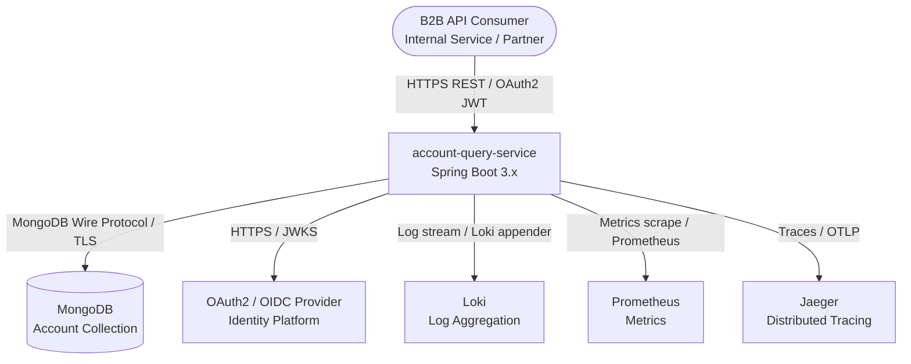
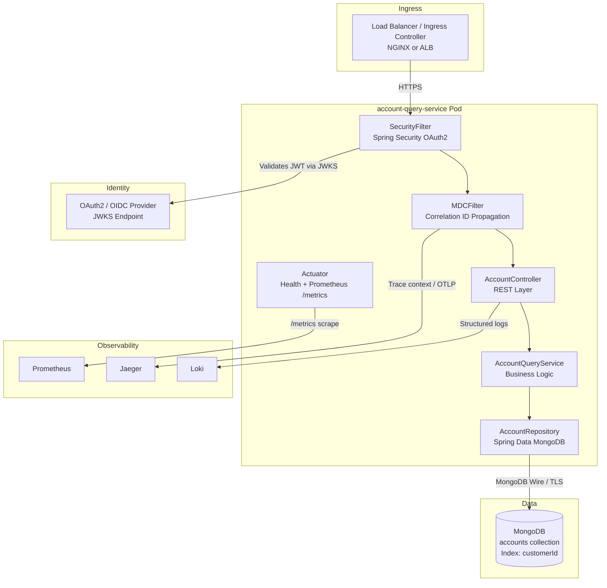
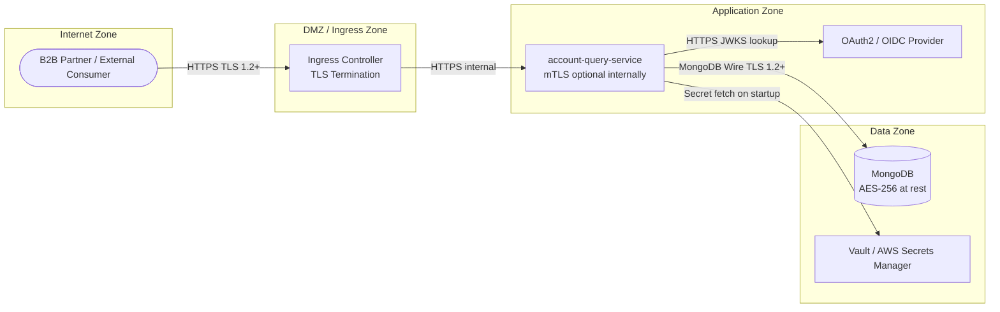
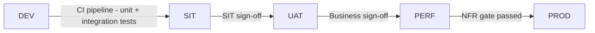

# High-Level Design (HLD)

| Field | Value                            |
|-------|----------------------------------|
| HLD-ID | HLD-20260425-001                 |
| Status | LOCKED                           |
| Version | 1.0.1                            |
| LRS Reference | LRS-20260425-001 (LOCKED v1.0.1) |
| Service | account-query-service            |
| Generated | 2026-04-25                       |
| Generated By | AI (generate-hld skill v1.0.0)   |
| Reviewed By | — Vidhan Chandra                 |

---

## 1. Business Context Summary

The `account-query-service` is a read-only REST API that allows B2B consumers (internal services and authorized partners) to retrieve bank account details for a given customer from a MongoDB data store. It is a single-purpose, high-read service with no write operations. Data is CONFIDENTIAL (financial PII) and subject to GDPR, FCA, and PCI-DSS compliance requirements.

---

## 2. Architecture Pattern

**Selected Pattern: Single-Domain Spring Boot Microservice (Read-Optimised)**

| Criterion | Assessment |
|-----------|-----------|
| Domain scope | Single bounded context — account retrieval only |
| Write operations | None — read-only API |
| Load profile | 200 TPS peak, horizontally scalable |
| Async processing | Not required — synchronous REST responses |
| Integration complexity | Low — one data store (MongoDB), one IdP (OAuth2) |

**Rationale:** The service has a single bounded context (account query), performs no write operations, and requires straightforward synchronous REST responses. A microservices split or event-driven pattern would introduce unnecessary operational complexity. A lean, single-purpose Spring Boot service with horizontal pod scaling (HPA) is the correct fit. CQRS is not warranted as there is no write model to separate from.

---

## 3. System Context Diagram (C4 Level 1)

---

## 4. Component Diagram (C4 Level 2)

---

## 5. Technology Stack

| Layer | Technology | Version | Rationale |
|-------|-----------|---------|-----------|
| Language | Java | 17 LTS | Company standard; long-term support |
| Framework | Spring Boot | 3.x | Company standard; Jakarta namespace; production-proven |
| Data Access | Spring Data MongoDB | 4.x (via Spring Boot 3) | Native MongoDB abstraction; repository pattern |
| MongoDB Driver | MongoDB Java Driver | 4.x | Bundled with Spring Data MongoDB |
| Security | Spring Security OAuth2 Resource Server | 6.x | JWT validation via JWKS; company standard auth pattern |
| API Layer | Spring MVC (embedded Tomcat) | 6.x | Synchronous REST; sufficient for 200 TPS target |
| Error Handling | Spring 6 RFC 7807 ProblemDetail | Built-in | Company standard; consistent error contract |
| Build | Maven | 3.9+ | Company standard |
| Code Generation | Lombok | Latest stable | Company standard; eliminates boilerplate |
| Mapping | MapStruct | 1.5+ | Compile-time entity → DTO mapping |
| Observability — Metrics | Micrometer + Prometheus | Latest stable | Scrape-based metrics; aligns with platform Prometheus stack |
| Observability — Tracing | OpenTelemetry + Jaeger | Latest stable | Distributed tracing; aligns with platform Jaeger stack |
| Observability — Logging | Logback + Loki appender | Latest stable | Structured JSON logs; MDC traceId propagation |
| Container | Docker | Latest stable | OCI image; deployed to EKS / OCP |
| Deployment | Amazon EKS or OpenShift OCP | Platform-managed | Company standard deployment targets |
| Secret Management | Vault / AWS Secrets Manager | Platform-managed | No hardcoded secrets; company mandatory |

---

## 6. Security Architecture

### 6.1 Trust Boundaries

### 6.2 Authentication & Authorisation

| Concern | Decision |
|---------|---------|
| Authentication | OAuth2 JWT Bearer token — Spring Security Resource Server validates token signature against IdP JWKS endpoint on every request |
| Authorisation | RBAC via JWT scopes: `accounts:read` required for all account retrieval endpoints |
| Token validation | Stateless — no session; JWKS public key cached locally with TTL refresh |
| Scope enforcement | `@PreAuthorize("hasAuthority('SCOPE_accounts:read')")` on service layer |

### 6.3 Data Protection

| Concern | Decision |
|---------|---------|
| Encryption in transit | TLS 1.2+ enforced on all connections: ingress → service, service → MongoDB |
| Encryption at rest | AES-256 at MongoDB storage layer |
| Data classification | CONFIDENTIAL — account numbers, balances, sort codes are financial PII |
| PII handling | B2B API — no field masking (confirmed in LRS FR-11). Authorised callers are trusted services with `accounts:read` scope |
| Secret management | MongoDB connection string and credentials sourced exclusively from Vault / AWS Secrets Manager via environment variable injection. Never in code or config files |

### 6.4 Audit Logging

Every API call is logged with the following fields (MDC-propagated):

| Field | Source |
|-------|--------|
| `correlationId` | `X-Correlation-Id` header (generated if absent) |
| `callerIdentity` | JWT `sub` or `client_id` claim |
| `customerId` | Path variable from request |
| `httpMethod` | Request method |
| `httpStatus` | Response status code |
| `durationMs` | Request duration |
| `timestamp` | ISO-8601 UTC |

---

## 7. NFR → Architecture Decision Mapping

| NFR (from LRS) | Architecture Decision |
|----------------|----------------------|
| P95 < 300ms at 200 TPS | Single-hop read path: Controller → Service → MongoDB with index on `customerId`. No intermediate cache needed at 200 TPS given indexed MongoDB reads. Revisit if TPS grows beyond 500. |
| 99.9% availability (≤ 43.8 min/month) | Minimum 2 pod replicas enforced via `PodDisruptionBudget minAvailable: 2`; multi-AZ node scheduling via pod anti-affinity rules; readiness probe gates traffic until service is healthy |
| Horizontal scaling to 3x baseline | Horizontal Pod Autoscaler (HPA) configured on CPU (target 60%) and custom Prometheus metric (requests/sec); scales up to 6 replicas |
| MongoDB index on `customerId` | Index creation enforced via Spring Data MongoDB `@Indexed` annotation on entity and verified in startup migration script. DBA confirmed (LRS §8) |
| OAuth2 JWT auth | Spring Security OAuth2 Resource Server; JWKS endpoint configured; public keys cached with 5-min TTL |
| GDPR / FCA / PCI-DSS | Audit log on every request; TLS enforced; AES-256 at rest; secrets in Vault; no PII in logs (customerId logged, not account number) |
| DR RTO < 1 hour | MongoDB replica set with automated failover; pod rescheduling on healthy nodes within minutes; stateless service restarts in < 2 min |
| DR RPO < 15 minutes | MongoDB replication lag < 1 min in steady state; replica set in same region |
| Prometheus metrics + Jaeger tracing | Micrometer Prometheus registry on `/actuator/prometheus`; OpenTelemetry auto-instrumentation for Jaeger trace export |

---

## 8. Architecture Decision Records

### ADR-01: MongoDB via Spring Data MongoDB (not Spring Data JPA + PostgreSQL)

**Status:** Proposed
**Context:** The project standard data store is PostgreSQL via Spring Data JPA. However, the LRS explicitly states MongoDB as the required data store for the accounts collection (existing collection owned externally).
**Decision:** Use Spring Data MongoDB with the MongoDB Java Driver. Do not introduce a PostgreSQL dependency for this service.
**Rationale:** The account collection already exists in MongoDB (confirmed in LRS §8). Introducing a separate PostgreSQL store would create a dual-store architecture with synchronisation complexity and no benefit. The requirement is read-only access to an existing MongoDB collection.
**Alternatives Considered:** PostgreSQL mirror with ETL — rejected (operational overhead, data freshness risk); MongoDB + JPA dual stack — rejected (unnecessary complexity).
**Consequences:** This service does not use Flyway (no relational schema). UUID primary keys are preserved via MongoDB `_id` fields. Team must ensure MongoDB driver version compatibility with Spring Boot 3.x.

---

### ADR-02: Synchronous REST — No Caching Layer at Initial Release

**Status:** Proposed
**Context:** NFR requires P95 < 300ms at 200 TPS. The options are: (a) direct MongoDB reads with index, or (b) add a Redis cache in front of MongoDB.
**Decision:** Launch without a Redis cache. Use a MongoDB index on `customerId` only.
**Rationale:** An indexed MongoDB read for a single customer's accounts will return in < 50ms under 200 TPS load (single-collection point query). Adding Redis at this load level introduces operational complexity (cache invalidation, TTL management, another infrastructure dependency) with no meaningful latency benefit. Caching should be introduced if load exceeds 500 TPS or if MongoDB P95 breaches 150ms under load testing.
**Alternatives Considered:** Redis cache with 30-second TTL — rejected for initial release (premature optimisation); CDN-level caching — rejected (B2B API with per-customer auth, no shared cache possible).
**Consequences:** If load testing in PERF environment shows MongoDB P95 > 200ms at 200 TPS, ADR-02 must be revisited and Redis introduced before production release.

---

### ADR-03: Stateless JWT Validation (No Introspection Endpoint)

**Status:** Proposed
**Context:** OAuth2 token validation can be done via (a) local JWT signature verification using JWKS, or (b) calling the IdP token introspection endpoint on every request.
**Decision:** Use local JWT signature verification via JWKS public key caching.
**Rationale:** Introspection adds a network round-trip to the IdP on every API call, adding 20-50ms latency and creating an availability dependency on the IdP for every request. Local JWT verification with JWKS key caching achieves the same security guarantee (signature + expiry check) with zero additional latency after initial key load. JWKS keys are cached with a 5-minute TTL and refreshed on `kid` mismatch.
**Alternatives Considered:** Token introspection on every call — rejected (latency + IdP coupling); opaque tokens — rejected (LRS specifies JWT).
**Consequences:** Token revocation is not instant (up to 5 minutes lag on key rotation). Acceptable for a read-only B2B API. If revocation SLA tightens, introduce short-TTL tokens or introspection fallback.

---

## 9. Environment & Deployment Overview

### 9.1 Environment Ladder

| Environment | Purpose | MongoDB | Notes |
|-------------|---------|---------|-------|
| DEV | Developer local testing | Local MongoDB (Docker Compose) | No external IdP; Keycloak local |
| SIT | System Integration Testing | Shared SIT MongoDB cluster | Integration with real IdP |
| UAT | User Acceptance Testing | UAT MongoDB cluster | Business sign-off |
| PERF | Performance / Load Testing | PERF MongoDB cluster | Gatling load tests; NFR validation |
| PROD | Production | Production MongoDB replica set | Full HA; multi-AZ |

### 9.2 Deployment Platform

**Primary:** Amazon EKS
**Alternate:** OpenShift OCP (Helm chart parameterised for both)

### 9.3 Kubernetes Resource Design

| Resource | Configuration |
|----------|-------------|
| Deployment | `replicas: 2` minimum; `maxReplicas: 6` via HPA |
| HPA | CPU target 60%; custom metric: `http_requests_per_second > 150` |
| PodDisruptionBudget | `minAvailable: 2` |
| Pod Anti-Affinity | Preferred spread across AZs (`topologyKey: topology.kubernetes.io/zone`) |
| Resource Requests | CPU: 250m, Memory: 512Mi |
| Resource Limits | CPU: 1000m, Memory: 1Gi |
| Readiness Probe | `GET /actuator/health/readiness` — 10s initialDelay, 5s period |
| Liveness Probe | `GET /actuator/health/liveness` — 30s initialDelay, 10s period |
| ConfigMap | Non-sensitive config (MongoDB host, IdP JWKS URI) |
| Secret | MongoDB credentials + any sensitive config (sourced from Vault / AWS Secrets Manager via CSI driver or init container) |

### 9.4 Release Strategy

**Strategy:** Rolling update (initial release)
**Rationale:** Read-only service with no schema changes — zero-downtime rolling updates are safe. Canary or blue-green to be considered if write operations are added in a future phase.

---

## 10. API Surface Overview

> Full API specification is produced in Phase 07 (generate-openapi skill). This section is a high-level summary only.

| Method | Path | Scope Required | Description |
|--------|------|---------------|-------------|
| GET | `/api/v1/customers/{customerId}/accounts` | `accounts:read` | Retrieve all accounts for a customer |
| GET | `/api/v1/customers/{customerId}/accounts?status=ACTIVE` | `accounts:read` | Retrieve accounts filtered by status |
| GET | `/actuator/health` | None | Kubernetes health probes |
| GET | `/actuator/prometheus` | None (network-scoped) | Prometheus metrics scrape |

---

## 11. Open Items for LLD

The following must be confirmed during LLD (Phase 03) before implementation:

| Item | Detail |
|------|--------|
| MongoDB collection name | Confirm exact collection name with Data team |
| MongoDB document field names | Map document fields to Java entity fields |
| OAuth2 IdP JWKS URI | Obtain from IAM team (Q-06 from LRS still open) |
| JWT scope names | Confirm `accounts:read` scope name with security team |
| Response schema for empty account list | Q-07 resolved as 200 + empty list — confirm in LLD contract |
| Account status enum values | Confirm ACTIVE / CLOSED / SUSPENDED are exhaustive |

---

## 12. Approval Sign-Off

> WARNING: Status remains DRAFT until all approvers sign. This HLD must be APPROVED before LLD work begins.

| Role | Name   | Decision | Date | Comments |
|------|--------|---------|------|---------|
| Solution Architect | Vidhan | Approved| | |
| Security Reviewer | ABC    | Approved | | |
| Engineering Lead | XYZ    | Approved | | |
| Product Owner | AAAAA  | Approved | | |

---

## 13. Traceability

| LRS-ID | Requirement Summary | HLD Section |
|--------|--------------------|----|
| LRS-20260425-FR-01 | REST endpoint returns accounts by customer ID | §3, §10 |
| LRS-20260425-FR-02 | Query MongoDB by customer ID | §4, §5 (REPO component), §7 |
| LRS-20260425-FR-03 | Return defined account detail fields | §10, Open Items §11 |
| LRS-20260425-FR-04 | List response for multiple accounts | §10 |
| LRS-20260425-FR-05 | HTTP 404 ProblemDetail — customer not found | §5 (AC component) |
| LRS-20260425-FR-06 | HTTP 400 ProblemDetail — malformed customer ID | §5 (AC component) |
| LRS-20260425-FR-07 | HTTP 401 — invalid bearer token | §6.2 |
| LRS-20260425-FR-08 | HTTP 403 — insufficient scope | §6.2 |
| LRS-20260425-FR-09 | X-Correlation-Id in every response | §6.4 (MDC component) |
| LRS-20260425-FR-10 | Optional account status filter | §10 |
| LRS-20260425-FR-11 | No masking — B2B API (confirmed) | §6.3 |
| LRS-20260425-FR-12 | Pagination support (COULD) | §10, deferred to LLD |