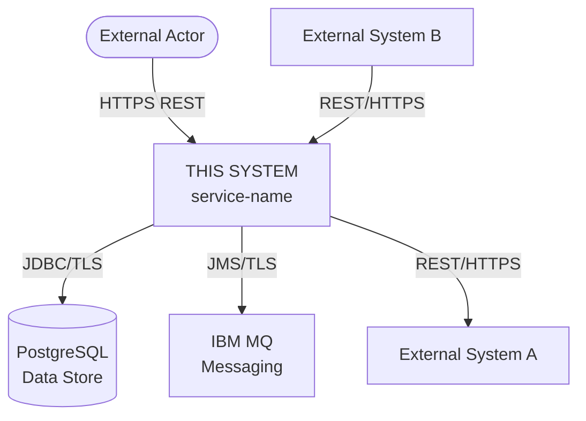
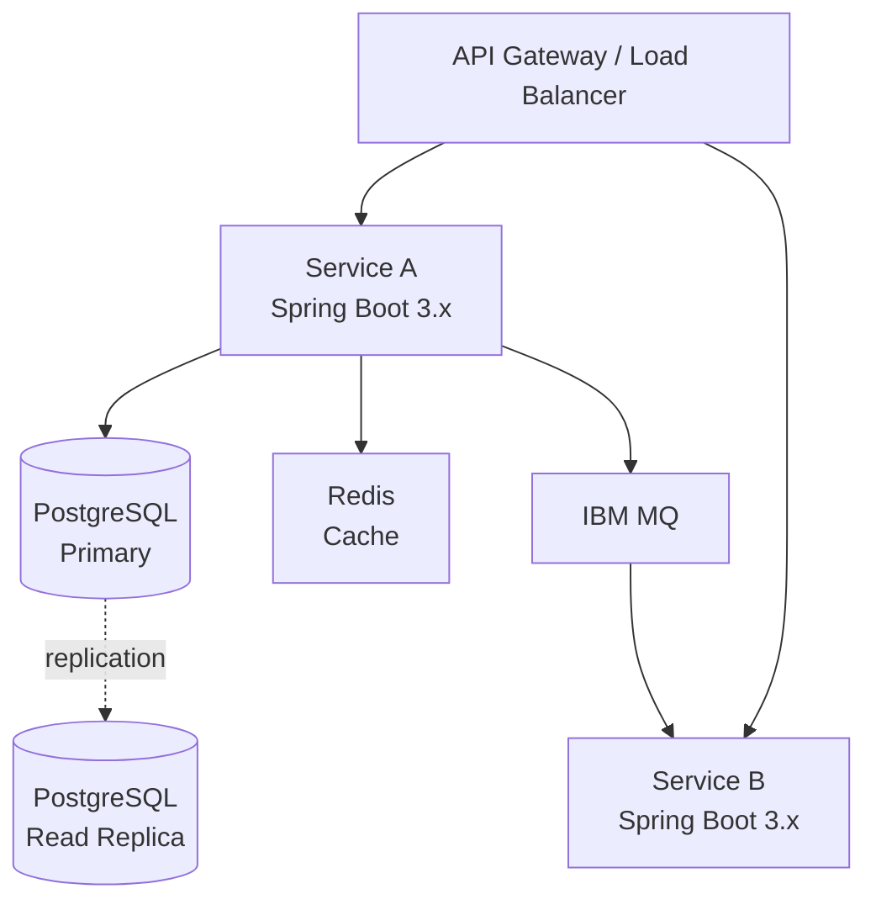

# Skill: Generate High-Level Design (HLD)

## Purpose

Produce a clear, architect-reviewable HLD from an approved LRS. The HLD must be complete enough for an architect to make informed sign-off decisions and for the LLD to be derived from it without ambiguity.

---

## Pre-conditions

- Input LRS must have Status: `LOCKED` (or note if it is still DRAFT and flag accordingly)
- If LRS is DRAFT, generate the HLD but add a prominent warning: `⚠️ NOTE: Input LRS is not yet LOCKED. This HLD is provisional and must not be used until LRS is approved.`

---

## Step-by-Step Instructions

### Step 1 — Analyse the LRS

Before writing anything, read the full LRS and extract:
- All integration points (systems, protocols, directions)
- All NFRs (availability, scalability, performance, security)
- Security requirements (auth, data classification, compliance)
- Deployment constraints (EKS, OCP, on-prem, cloud)
- Technology constraints already stated

### Step 2 — Select Architecture Pattern

Based on the LRS, choose and justify the architecture pattern:

| Scenario | Recommended Pattern |
|---------|-------------------|
| Single bounded domain, moderate load | Monolithic Spring Boot service |
| Multiple bounded contexts, independent scaling | Microservices |
| Event-driven, async processing dominant | Event-driven architecture with IBM MQ |
| High-read, low-write | CQRS with read model |
| Mixed sync/async | Hybrid REST + messaging |

State your choice and rationale explicitly.

### Step 3 — Draw System Context Diagram (C4 Level 1)

Produce a Mermaid diagram showing:
- The system being built (box in centre)
- All external actors (users, client systems)
- All external systems (upstream/downstream)
- Communication protocols on each arrow



### Step 4 — Draw Component Diagram (C4 Level 2)

Show internal components within the system boundary:



### Step 5 — Define Technology Stack

For each layer, specify technology, version, and one-line rationale. Reference any company standards.

| Layer | Technology | Version | Rationale |
|-------|-----------|---------|-----------|
| Language | Java | 17 LTS | Company standard |
| Framework | Spring Boot | 3.x | Company standard |
| ... | | | |

### Step 6 — Design Security Architecture

Map all security concerns from the LRS to architectural decisions:
- Trust boundaries (draw as zones: Internet → DMZ → App → Data)
- Auth/AuthZ pattern and implementation
- Encryption approach (in transit, at rest)
- Secret management tool
- Network segmentation

### Step 7 — Map NFRs to Architecture Decisions

For every NFR in the LRS, state how the architecture addresses it. Do not leave any NFR unaddressed.

| NFR | Architecture Decision |
|-----|----------------------|
| 99.9% availability | Multi-AZ deployment, PodDisruptionBudget minAvailable: 2 |
| P95 < 500ms | Redis caching for read paths, async MQ for heavy writes |
| ... | ... |

### Step 8 — Define ADRs

Write an Architecture Decision Record for each significant choice made. Format:

```
## ADR-{nn}: {Decision Title}

**Status:** Proposed
**Context:** {Why was a decision needed}
**Decision:** {What was decided}
**Rationale:** {Why this option over alternatives}
**Alternatives Considered:** {what else was evaluated}
**Consequences:** {trade-offs, risks}
```

Write at least 2 ADRs. Write one for every non-obvious decision.

### Step 9 — Define Environment & Deployment Overview

State: target platform (EKS / OCP), regions/zones, environment ladder (DEV → SIT → UAT → PERF → PROD), release strategy (canary / blue-green / rolling).

### Step 10 — Assemble and Output

Output the complete HLD using the structure in `references/HLD-output-format.md`.
Set Status to `DRAFT`.

---

## Quality Checklist

Before outputting:
- [ ] C4 Level 1 diagram present and correct
- [ ] C4 Level 2 diagram present and correct
- [ ] Every LRS integration point appears in the diagrams
- [ ] Every LRS NFR is addressed in the architecture
- [ ] Every LRS security requirement is addressed
- [ ] Technology stack is complete (no layers left blank)
- [ ] At least 2 ADRs written
- [ ] Trust boundary / security zone diagram present
- [ ] Deployment overview covers EKS or OCP (or both if both are required)
- [ ] Status is `DRAFT`
- [ ] LRS-ID referenced in document header

---

## Rules

- **Never choose a technology without stating why** — every choice needs a rationale
- **Never leave an NFR unaddressed** — if the architecture cannot meet an NFR, say so and flag it
- **Never draw a diagram without labelling protocols on arrows**
- **Microservices by default is wrong** — choose based on the LRS, not trends
- **If LRS is DRAFT, generate but warn prominently**

---

## Reference Files

- `references/HLD-output-format.md` — full HLD template structure
- `references/architecture-patterns.md` — pattern catalogue with pros/cons
- `references/technology-standards.md` — approved technology versions
